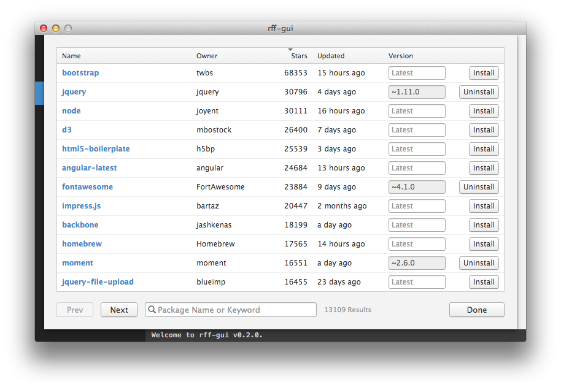
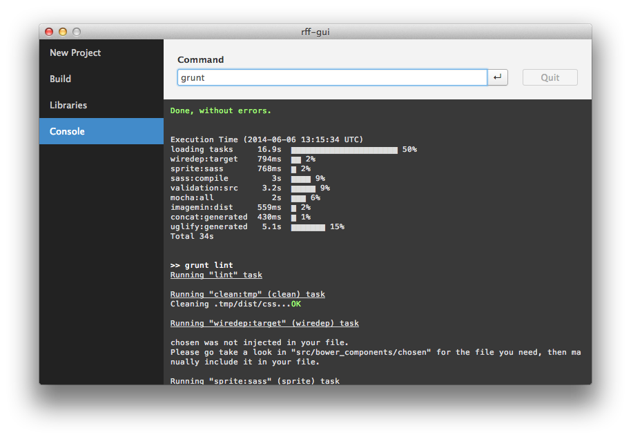

# Rakuten Front-end Framework GUI

> Cross-platform application for smart development of web front-end. (WIP)

## Overview
This application is **UNDER DEVELOPMENT** for publishing as OSS.  

rff-gui is the GUI front-end of [generator-rff](https://github.com/rakuten-frontend/generator-rff).
It provides the GUI for Yeoman, Grunt and Bower.  
This app works on cross-platform -- Windows, Mac and Linux.

## Trial
Checkout [develop branch](https://github.com/rakuten-frontend/rff-gui/tree/develop).

## Screenshots

---
Copyright (c) 2014 Rakuten, Inc.
